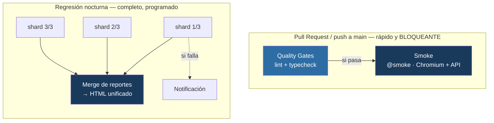

# Pipeline CI/CD — Playwright (UI + API) sobre GitHub Actions

Pipeline de **Integración Continua** que orquesta una suite combinada de tests de **UI** y **API** sobre GitHub Actions, con las prácticas de un entorno de producción: quality gates, ejecución en dos velocidades, matriz con sharding y agregación de reportes.


---

## Resumen ejecutivo

| | |
|---|---|
| **Qué es** | La automatización de la ejecución de tests: cómo corren, cuándo y con qué garantías, de forma automática en cada cambio. |
| **Problema que resuelve** | Una suite que se corre a mano aporta la mitad del valor. El desafío es dar **feedback rápido** en cada cambio sin sacrificar la **cobertura exhaustiva**. |
| **Enfoque** | Estrategia de dos velocidades: verificación rápida y bloqueante en cada pull request; regresión completa cross-browser programada. |
| **Resultado** | Feedback de calidad en segundos por PR (gates + smoke), y cobertura total nocturna con sharding y reporte unificado. Ninguna integración a `main` sin verificación. |
| **Stack** | GitHub Actions · Playwright · ESLint · TypeScript |

---

## Arquitectura del pipeline



---

## Los dos workflows

### `pr-checks.yml` — en cada PR y push a `main`

Feedback en segundos. Quality gates (lint + typecheck) como etapa previa; si pasan, corre el smoke crítico (`@smoke`) en Chromium + API. Es **bloqueante**: ninguna integración avanza sin pasar. Incluye control de concurrencia que cancela ejecuciones redundantes del mismo branch.

### `nightly-regression.yml` — programado (cron) y a demanda

Ejecuta la suite completa en los 3 navegadores + API, repartida en 3 shards paralelos. Un job final **mergea** los reportes parciales en un HTML unificado; otro **notifica** ante fallos. Disparable manualmente (`workflow_dispatch`).

---

## Capacidades de CI/CD

| Práctica | Implementación |
|---|---|
| **Dos velocidades** | PR rápido/bloqueante vs regresión nocturna completa |
| **Quality gates** | `lint` + `typecheck` previos a los tests (fail fast) |
| **Job dependencies** | `smoke` depende de `quality-gates` (`needs`) |
| **Cron scheduling** | Regresión programada sin intervención |
| **Matriz + sharding** | Suite repartida en 3 ejecuciones paralelas |
| **Merge de reportes** | Blob reports unificados en un HTML |
| **Concurrency control** | Cancelación de runs redundantes |
| **Resiliencia de red** | Reintento de pasos dependientes de red |
| **Cross-browser** | Chromium, Firefox y WebKit |

---

## Estructura

```
.github/workflows/
├── pr-checks.yml            # pipeline rápido/bloqueante de PR
└── nightly-regression.yml   # regresión nocturna (cron + sharding + merge)
src/                         # page objects (UI) + clients/schemas (API) + fixtures
tests/
├── ui/    # tests de interfaz (usan navegador)
└── api/   # tests de API (HTTP puro)
playwright.config.ts         # proyectos UI (x3 browsers) + api, por testMatch
```

---

## Uso

```bash
npm install
npx playwright install

npm test                 # suite completa (UI x3 + API)
npm run test:pr          # lo que corre el gate de PR (smoke chromium + api)
npm run test:ui          # solo UI, cross-browser
npm run test:api         # solo API
npm run lint             # quality gate
npm run typecheck        # quality gate
```

---

## Documentación técnica

**[docs/DOCUMENTACION-TECNICA.md](docs/DOCUMENTACION-TECNICA.md)** detalla el diseño: anatomía de un workflow, la estrategia de dos velocidades, quality gates, job dependencies, sharding, merge de reportes, cron, secretos, concurrencia y costos.

---

## Contexto

Tercero de una serie de proyectos de automatización de calidad:

1. [Framework E2E de UI (Playwright)](https://github.com/fercarballo/playwright-e2e-framework-saucedemo)
2. [Testing de API (Playwright + Zod)](https://github.com/fercarballo/api-testing-framework-restful-booker)
3. **Pipeline CI/CD** — este repositorio
4. [Estabilidad y flakiness](https://github.com/fercarballo/flakiness-hunting-playwright)
5. [Regresión visual & contract testing](https://github.com/fercarballo/visual-and-contract-testing)

---

## Licencia

MIT.
